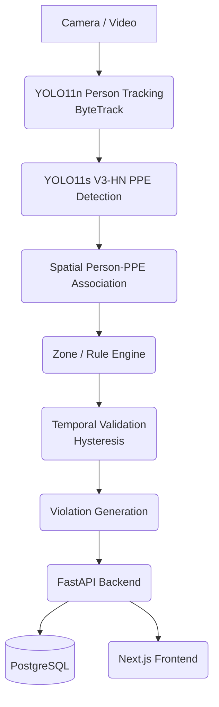

# EdgeVision Architecture

```mermaid
flowchart TD
    A[Camera / Video] --> B(YOLO11n Person Tracking\nByteTrack)
    B --> C(YOLO11s V3-HN PPE Detection)
    C --> D(Spatial Person-PPE Association)
    D --> E(Zone / Rule Engine)
    E --> F(Temporal Validation\nHysteresis)
    F --> G(Violation Generation)
    G --> H(FastAPI Backend)
    H --> I[(PostgreSQL)]
    H --> J(Next.js Frontend)
```

*(Note: Please export this markdown file to PDF or PNG as required by your submission portal using standard markdown conversion tools.)*
