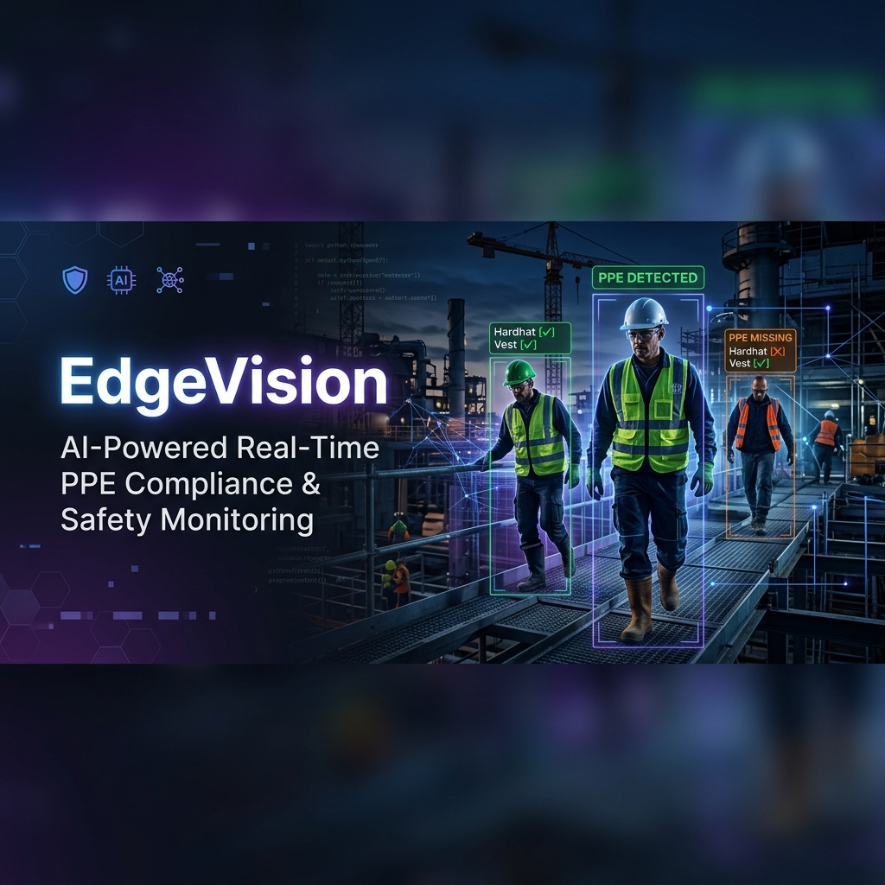
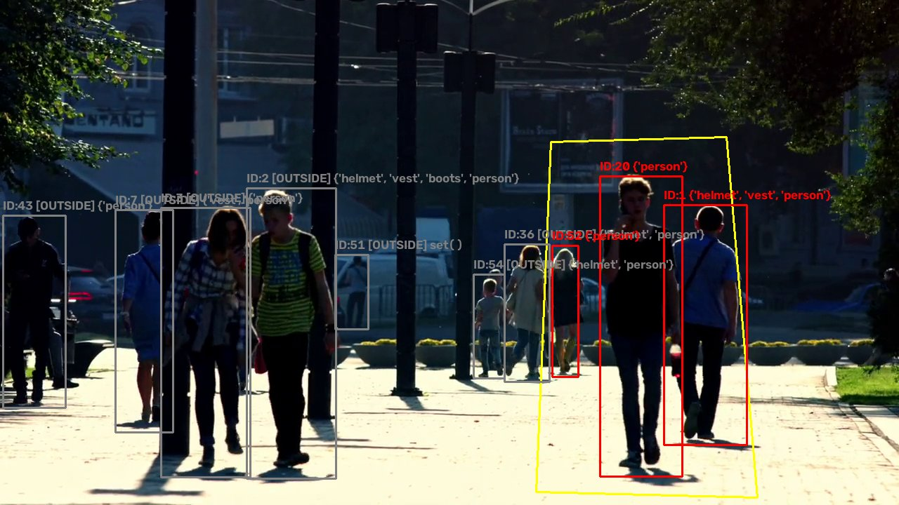
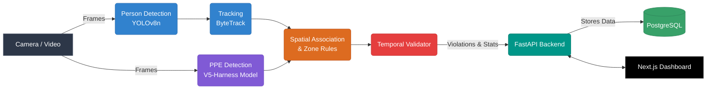

<div align="center">
  

  # 🛡️ EdgeVision

  **Real-time PPE Compliance and Work-at-Height Safety Monitoring**  
  *Powered by YOLOv8, ByteTrack, and the validated V5-Harness model.*

  [](https://www.python.org/)
  [](https://nodejs.org/)
  [](https://fastapi.tiangolo.com/)
  [](https://nextjs.org/)
  [](https://ultralytics.com/)
</div>

---

## 🌟 Overview

EdgeVision is an end-to-end, real-time safety compliance platform designed for industrial and construction environments. It automatically detects workers, tracks them across zones, and verifies whether they are wearing required Personal Protective Equipment (PPE) such as helmets and vests.

### ✨ Key Features
- **Real-Time AI Detection**: Uses highly optimized YOLOv8 and V5-Harness models for instance segmentation and classification.
- **Robust Tracking**: Integrates ByteTrack for consistent temporal association and trajectory monitoring.
- **Dynamic Rule Engine**: Define custom spatial zones and apply specific PPE rules to each area.
- **Modern Dashboard**: A sleek Next.js React frontend for live monitoring, statistics, and configuration.
- **Edge Deployment Ready**: Designed to run optimally on NVIDIA Jetson edge devices using TensorRT.

---

## 📸 Live Inference Demo

EdgeVision accurately identifies workers and validates required PPE in real-time, highlighting compliance violations instantly:

<div align="center">
  
</div>

> *Live camera output captured from `outputs/live_camera` and full video pipeline results are generated in `outputs/results`.*

---

## 🏗️ Architecture

The EdgeVision pipeline is designed for low-latency, high-throughput processing.



---

## 🚀 Quick Start (Windows — Development)

### Prerequisites
- Python 3.9+
- Node.js 18+
- Docker Desktop

### 1️⃣ Start the Database
```bash
docker-compose up -d db
```

### 2️⃣ Initialize Backend
*(First run only)*
```bash
cd backend
pip install fastapi uvicorn sqlalchemy psycopg2-binary pydantic-settings
python scripts/init_db.py
```

### 3️⃣ Start FastAPI Backend
```bash
# In backend/
python -m uvicorn app.main:app --port 8000
```
- **Health Check**: [http://localhost:8000/api/v1/health](http://localhost:8000/api/v1/health)
- **API Docs**: [http://localhost:8000/docs](http://localhost:8000/docs)

### 4️⃣ Start Next.js Frontend
```bash
# In frontend/
npm install
npm run dev
```
- **Dashboard**: [http://localhost:3000](http://localhost:3000)

### 5️⃣ Run the ML Demo Pipeline
```bash
# In the root directory
python src/pipeline.py
```

---

## 🐧 Edge Deployment (Linux / Jetson)

EdgeVision is built for high-performance edge inference on NVIDIA Jetson devices (JetPack 5.x/6.x).

1. **Transfer Files**: Copy the project to your Jetson device.
2. **Install Dependencies**:
   ```bash
   cd deployment
   sudo bash install_jetson.sh
   ```
3. **Start the Service**:
   ```bash
   sudo systemctl start edgevision
   ```
4. **Compile TensorRT Engine**: For maximum FPS, compile the ONNX model to a TensorRT engine. Instructions are in `10_DOCUMENTATION/USER_GUIDE.md` or the deployment docs.
5. **View Dashboard**: Navigate to `http://<JETSON_IP>:3000` from any device on the network.

---

## 📊 Models & Performance

### Included Models
| Model | File | Status |
| :--- | :--- | :--- |
| **V5-Harness** (Production) | `models/ppe_v5_harness.pt` | 🟢 **ACTIVE** |
| **V3-HN** (Rollback) | `models/ppe_v3_hn_best.pt` | 🟡 **AVAILABLE** |

### Key Metrics (V5-Harness, Warm, RTX 4050)
| Metric | Value |
| :--- | :--- |
| **mAP50** | `84.20%` |
| **Helmet Recall** | `82.33%` |
| **Vest Recall** | `73.76%` |
| **Real-World FP** | `0 / 0` |
| **Warm FPS** | `16.2` |
| **P95 Latency** | `134.63 ms` |

> [!WARNING]  
> **Known Limitations**
> - The `lanyard` and `hook` classes are **NOT trained** in the V5-Harness model (marked as UNTRAINED in the UI).
> - Jetson TensorRT benchmarking is **PENDING PHYSICAL HARDWARE**.

---

## 📚 Documentation Reference

For more detailed technical documentation, please refer to the files in the `docs` folder:

- 📖 **[Handover Document](docs/HANDOVER.md)** — Read first for project handovers.
- ⚙️ **[Setup Guide](docs/SETUP.md)** — Detailed environment setup.
- 🧑‍💻 **[User Guide](docs/USER_GUIDE.md)** — How to operate the platform.
- 📄 **[PRD Specification](docs/PRD.pdf)** — Product requirements and architectural constraints.

---
<div align="center">
  <sub>Built with ❤️ for workplace safety.</sub>
</div>
