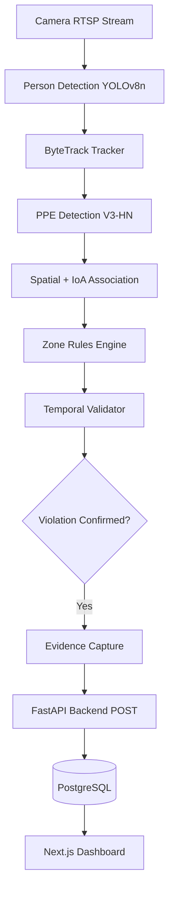

# EdgeVision Architecture

## Overview
EdgeVision is a highly optimized, edge-deployable computer vision platform for enforcing PPE (Personal Protective Equipment) and work-at-height safety compliance.

## Core Flow

## ML Components
- **Person Detection:** Primary inference (PGIE) using `yolov8n.pt`. Identifies workers.
- **Tracker:** ByteTrack algorithm maintains temporal identity across frames (temporary IDs).
- **PPE Detection:** Secondary inference (SGIE) using the frozen `V3-HN` model. Identifies helmets and vests with 0 false positives in real-world testing.
- **Temporal Validator:** Applies a hysteresis window (e.g. must lack PPE for 8 out of 10 frames over a 2-second period in a zone) to prevent alert fatigue from momentary occlusions.

## Web Platform
- **Backend:** FastAPI (Python) for asynchronous REST API serving and database ORM management.
- **Frontend:** Next.js (React) application for live monitoring and historical auditing.
- **Database:** PostgreSQL (via Docker) to store violation logs and inference metrics.
